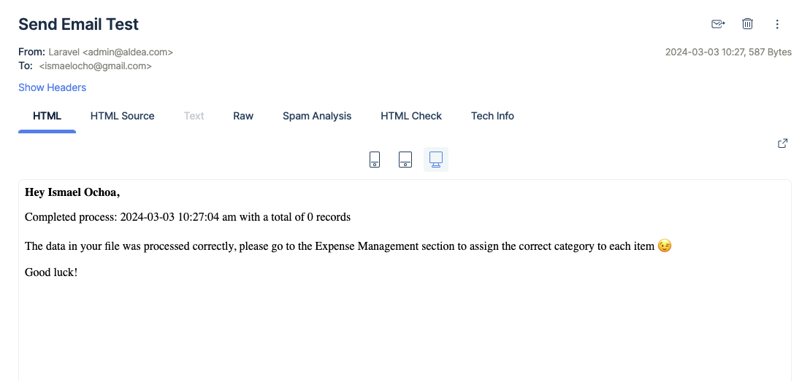
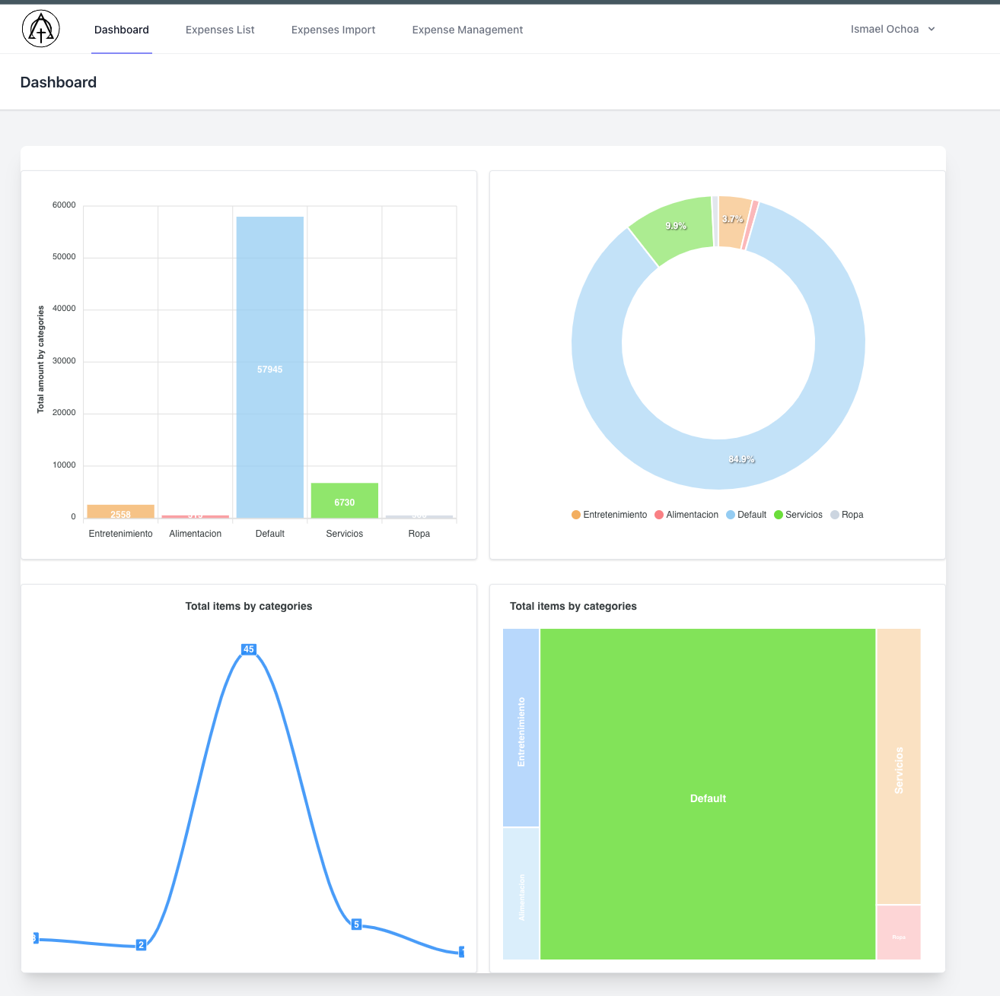
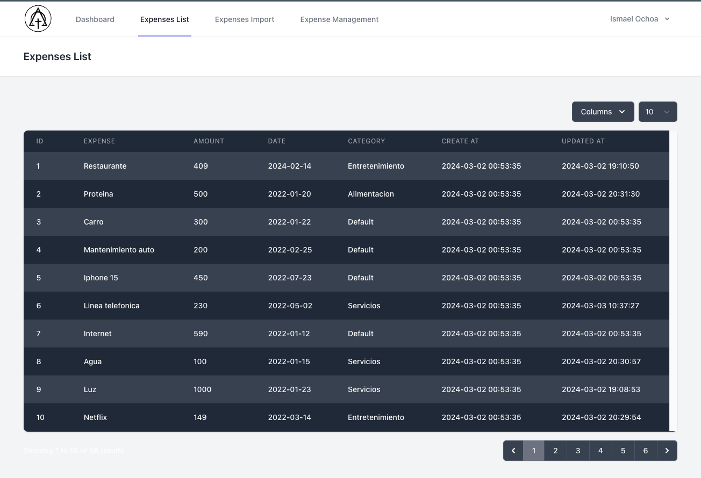
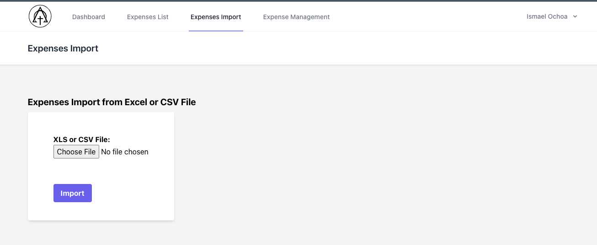
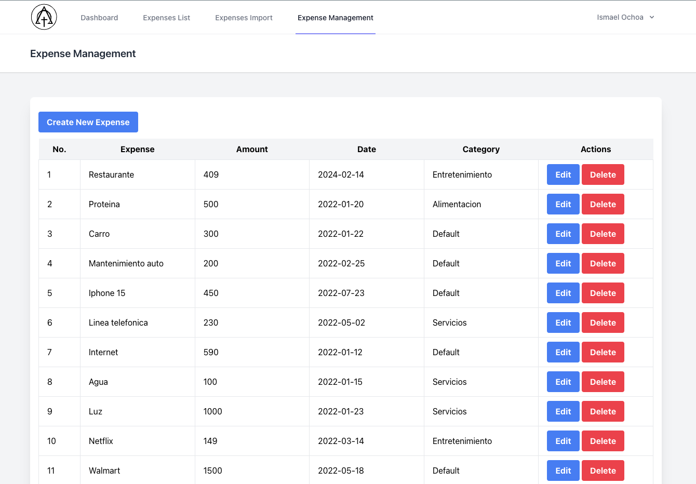
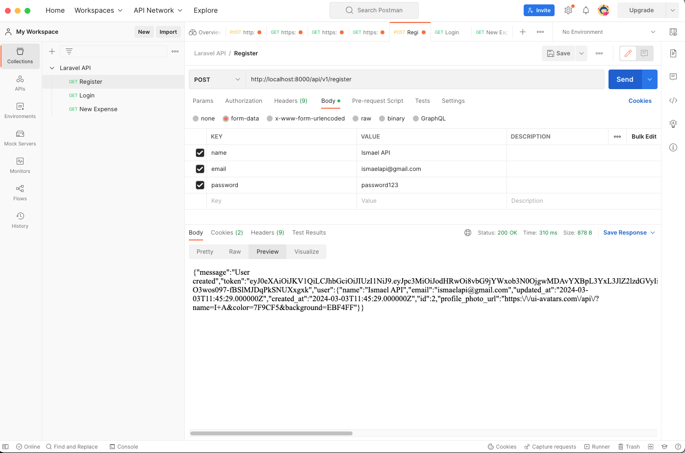
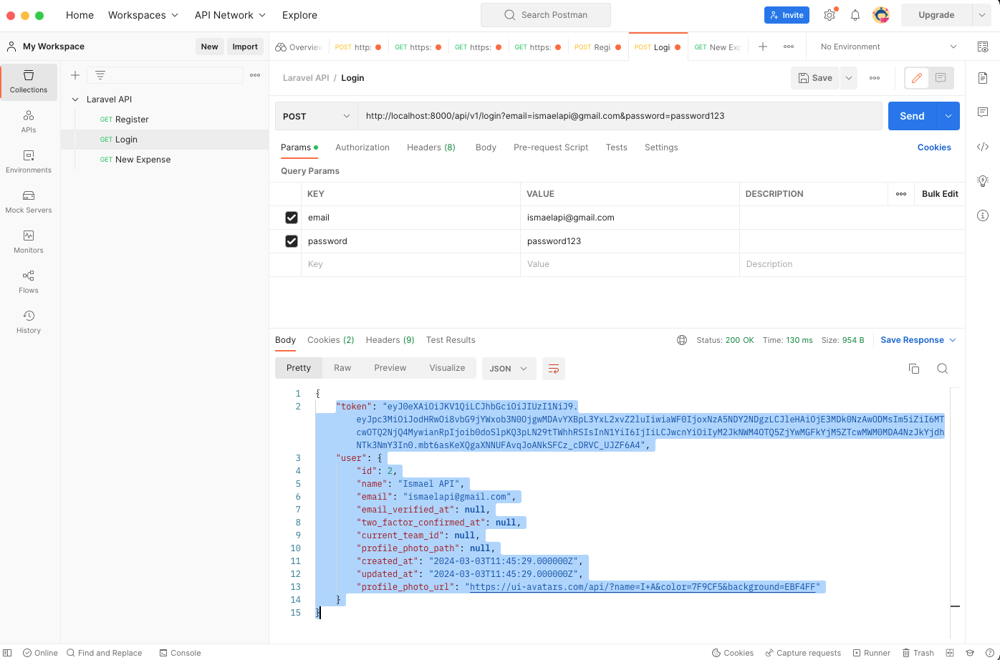
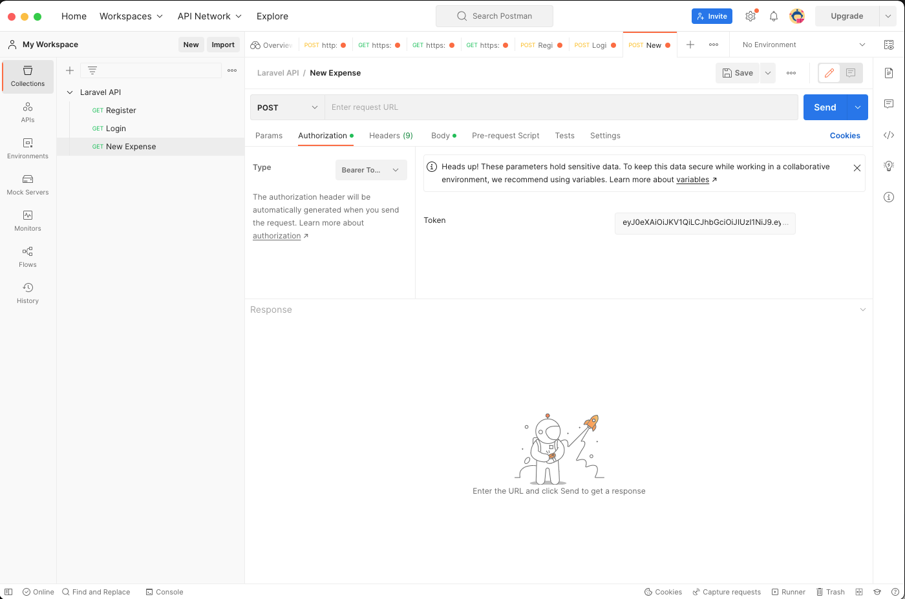
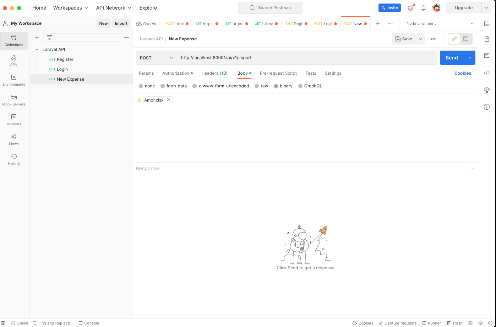

<div id="top"></div>

[![LinkedIn][linkedin-shield]][linkedin-url]


<!-- PROJECT LOGO -->
<br />
<div align="center">
  <a href="https://ismaelocho@github.com/ismaelocho/laravel-import-csv/">
    
  </a>

  <h3 align="center">laravel-import-csv</h3>


</div>

<!-- ABOUT THE PROJECT -->
## About The Project

The purpose of this project is to have a system with user authentication, who upon accessing have the option of uploading a csv or xls file to upload products and then assigning them a predefined category in the system, implementing filters for security and user errors.

Objetives:
* Have a user registration and authentication system.
* Use queues and jobs to process file uploads and extract data.
* Send notification email upon completion of processing of uploaded files.


### Built With

Built with the Laravel 9 framework and Livewire


* [![Laravel][Laravel.com]][Laravel-url]


<p align="right">(<a href="#top">back to top</a>)</p>


### Prerequisites

The prerequisites that must be met in order to run this application are listed.
* PHP 7.4^
* MySQL | MariaDB
* Composer 2.3^
* npm
  ```sh
  npm install npm@latest -g
  ```

### Installation

_Below is an example of how you can instruct your audience on installing and setting up your app. This template doesn't rely on any external dependencies or services._


1. Clone the repo
   ```sh
   git clone https://github.com/ismaelocho/laravel-import-csv.git
   ```
2. Add .env file and setup database and Queue connection
   ```sh
    DB_CONNECTION=mysql
    DB_HOST=mysql
    DB_PORT=3306
    DB_DATABASE=aldea
    DB_USERNAME=imroot
    DB_PASSWORD=thepassword

    QUEUE_CONNECTION=database

    MAIL_MAILER=smtp
   MAIL_HOST=sandbox.smtp.mailtrap.io
   MAIL_PORT=2525
   MAIL_USERNAME=XXX
   MAIL_PASSWORD=XXX
   MAIL_ENCRYPTION=tls
   MAIL_FROM_ADDRESS="admin@laravel.com"
   MAIL_FROM_NAME="${APP_NAME}"
   ```
3. point to the repository using cmd & run
   ```sh
   composer update
   ```
4. run "php artisan jwt:secret"
   ```sh
   php artisan jwt:secret
   ```
5. run migration 
   ```sh
   php artisan migrate
   ```
6. run migration & category seeder
   ```sh
   php artisan migrate:refresh --seed
   ```
7. run to compile objects
   ```sh
   npm install && npm run dev
   ```
8. generate key to encript API tokens
   ```sh
   php artisan jwt:secret
   ```
   

### QUEUE Notes

_To run the queuing process run the command

   ```sh
   php artisan queue:work
   ```

### Send Email Notes

_It is recommended to use the mailtrap.io service to test sending emails in a test environment.


Email


<p align="right">(<a href="#top">back to top</a>)</p>


### Web Version

_The web version has the sections of:

* Dashboard (charts and statitics)
* Expenses List
* Expenses Import (Import from Excel or CSV File)
* Expense Management (Edit info like category or amount and Delete records)


Dashboard

Expenses List

Expenses Import

Expense Management

### API Version

_The API version has the sections of:

* login (get token) -> "POST" --	api/v1/login
* register (create user) -> "POST" --	api/v1/register
* logout (delete token) -> "POST" --	api/v1/logout
* import (upload file csv or xls) -> "POST" --	api/v1/import

_To use the API version we recommend using POSTMAN to perform tests, the first step is to register the user, then login the user and thereby obtain the token, then with the token use it in the authorization section as Bearer Token and then go to the section body and select form-data and add a file type key with the name "file" and in value select the csv or xls file


login

register

authorization

import file


<!-- LICENSE -->
## License

Distributed under the MIT License. See `LICENSE.txt` for more information.

<p align="right">(<a href="#top">back to top</a>)</p>


<!-- MARKDOWN LINKS & IMAGES -->
[linkedin-shield]: https://img.shields.io/badge/-LinkedIn-black.svg?style=for-the-badge&logo=linkedin&colorB=555
[linkedin-url]: https://www.linkedin.com/in/ismael-ochoa-jul1986/
[Laravel.com]: https://img.shields.io/badge/Laravel-FF2D20?style=for-the-badge&logo=laravel&logoColor=white
[Laravel-url]: https://laravel.com